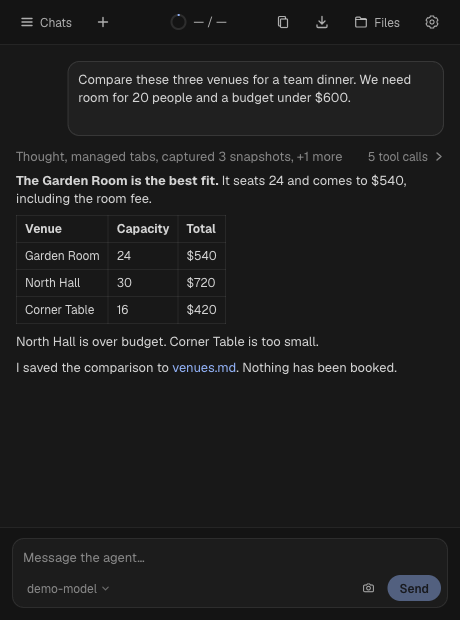
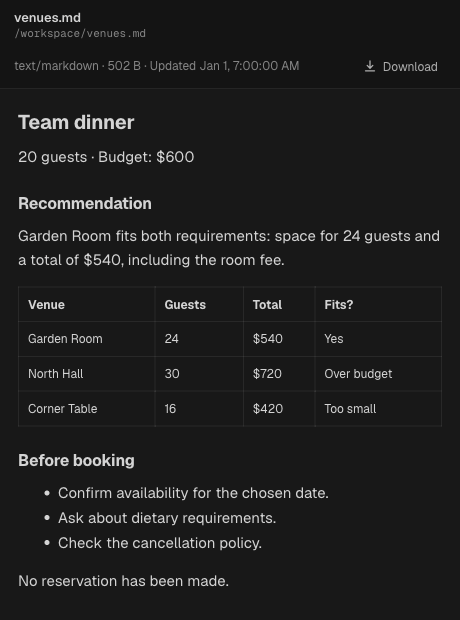

# Handoff

An AI browser extension for handing off work. Use it yourself, or let Claude Code and Cursor send it browser tasks.

Handoff works in the tabs you're already signed into. It can read pages, fill forms, work with files, and save workflows for later.

<p>
  
  
</p>

*The extension UI with fictional sample data.*

## Install

Requires Node.js 22+, Chrome 120+, and your own model account or API key.

```sh
npm ci
npm run build
```

Open `chrome://extensions`, enable **Developer mode**, then **Load unpacked** → select `dist/`. Open Handoff and connect a model.

## Use with a coding agent

```sh
claude mcp add handoff -- node /absolute/path/to/handoff/bridge/handoff-bridge.mjs mcp
```

Keep the side panel open when sending it work. [Bridge setup and Cursor instructions →](bridge/README.md)

[Contributing](CONTRIBUTING.md) · [Architecture](docs/architecture.md) · [Privacy](PRIVACY.md) · [Security](SECURITY.md) · [MIT license](LICENSE)
