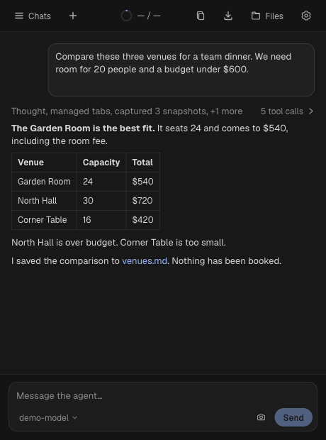
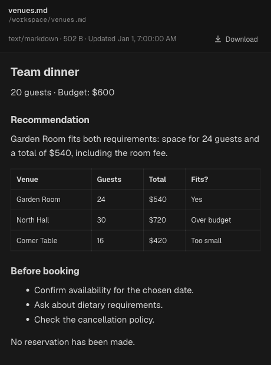

# Handoff

An AI browser extension for handing off work. Use it yourself, or let Claude Code and Cursor send it browser tasks.

Handoff works in the tabs you're already signed into. It can read pages, fill forms, work with files, and save workflows for later.

Connect a ChatGPT or Claude subscription, a provider API key, or your own OpenAI-compatible endpoint. Handoff supports verified dropdown and checkbox filling, reusable browser helpers, scheduled tasks, interactive artifacts, and delegation through its local bridge.

The chat feed shows grouped browser actions and reasoning, supports streaming tables and math, and can expand into a full tab. Accepted work continues in the background when the panel closes; interrupted work offers a safe resume or asks you to review the last action.

Cross-chat memory learns useful context in the background. Use **Settings → Memory** to inspect sources, edit or forget entries, pause learning, or turn off recall. Learning is enabled by default and uses a separate OpenAI-capable background route; see [data handling and controls](PRIVACY.md).

<p>
  
  
</p>

*The extension UI with fictional sample data.*

## Install

Requires Node.js 22+, Chrome 120+, and your own model account or API key.

```sh
npm ci
npm run build
```

Open `chrome://extensions`, enable **Developer mode**, then **Load unpacked** → select `dist/`. Open Handoff and connect a model.

When updating an existing installation, rebuild and click **Reload** in `chrome://extensions`. Claude browser transport requires the new `declarativeNetRequestWithHostAccess` permission. To expand the workspace, use the chat header's expand button or right-click the extension icon and select **Open in full tab**.

## Use with a coding agent

```sh
claude mcp add handoff -- node /absolute/path/to/handoff/bridge/handoff-bridge.mjs mcp
```

Keep the side panel open when sending it work. [Bridge setup and Cursor instructions →](bridge/README.md)

[Contributing](CONTRIBUTING.md) · [Architecture](docs/architecture.md) · [Privacy](PRIVACY.md) · [Security](SECURITY.md) · [MIT license](LICENSE)
